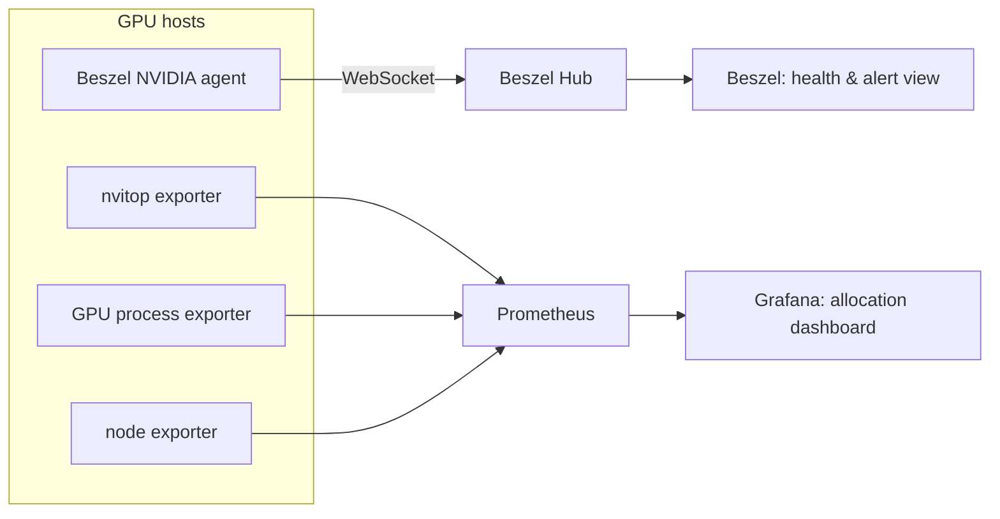

# Beszel integration research

**Decision:** run Beszel alongside the existing Prometheus and Grafana stack. Do not replace the current GPU exporters.

The project already has a strong division of responsibility:

- `nvitop-exporter` exposes host, per-GPU, and per-process NVIDIA metrics.
- `gpu-process-exporter` adds the missing PID-to-Docker-container mapping.
- Prometheus retains these labelled time series and Grafana presents cluster occupancy and the GPU Processes table.

Beszel is a better fit for an easy-to-read system-health and alerting view than for this project's GPU allocation view. Its agent collects a scalar record for each GPU: name, memory used/total, utilisation, temperature, and power. It does not collect a GPU process list, Linux user, PID, CUDA process memory, or a GPU-to-container mapping. That is visible both in Beszel's supported `GPUData` model and in its NVIDIA collector.

## Recommendation

Deploy a small Beszel pilot for seven days in parallel. Keep the existing three exporter containers, Prometheus, Grafana, scrape rules, and dashboard unchanged. Use the result to decide whether the Beszel system overview and alerts are useful enough to operate permanently.



This avoids a data migration, keeps the existing one-second GPU data and container attribution, and makes rollback as simple as stopping the new Beszel containers.

## Capability comparison

| Need in this project | Current stack | Beszel 0.20.0 | Result |
| --- | --- | --- | --- |
| Multi-node overview | Grafana dashboard | Hub with one agent per system | Supported by both |
| CPU, memory, disk, network and temperature | nvitop + node-exporter | Agent | Beszel can provide a cleaner host-health view |
| Per-GPU utilisation, VRAM, temperature, power | nvitop-exporter | NVIDIA agent | Supported by both |
| GPU process / PID / username | nvitop-exporter | No | Keep Prometheus and Grafana |
| GPU process mapped to Docker container | Custom exporter | No | Keep `gpu-process-exporter` |
| Filter the cluster by GPU user | Grafana variables | No equivalent | Keep Grafana |
| PromQL, custom capacity calculations and panels | Prometheus + Grafana | No | Keep Prometheus and Grafana |
| Host/container alerting | Prometheus rules only; no routing | Built-in alert channels | Good pilot target |
| OIDC and multi-user system access | Not currently configured | Built in | Consider later if needed |

## Pilot topology

Run the Hub on `wingene-76`, beside the existing monitoring stack. Give it its own persistent directory and a private LAN port such as `18090`; do not publish it outside the internal network during the pilot.

Each GPU host runs one `henrygd/beszel-agent-nvidia` container. The agent requires the NVIDIA Container Toolkit and the Docker socket mounted read-only. The existing hosts already meet those prerequisites because their exporter containers use the NVIDIA runtime and the custom process exporter reads the Docker socket.

Before starting, reconcile the target list: `prometheus/prometheus.yml` includes `wingene-82`, while `inventory/servers.yaml` and the README still list only `wingene-76` through `wingene-80`. The pilot should use the live Prometheus target list as its starting inventory and update the repository inventory in a separate, verified change.

Use Beszel's WebSocket mode: agents initiate the connection to the Hub. The Hub then verifies the registration token, signs a challenge, and verifies the agent fingerprint. The normal agent image also listens on port `45876` for Hub-initiated SSH mode, so firewall that port to the Hub or keep it otherwise inaccessible on the LAN.

## Proposed pilot configuration

The following is a deployment sketch only. It is intentionally not wired into the live `docker-compose.yml` yet, because the Hub's first admin account and each agent's key/token are created in the Hub UI.

### Hub on `wingene-76`

```yaml
services:
  beszel:
    image: henrygd/beszel:latest
    container_name: beszel
    restart: unless-stopped
    environment:
      APP_URL: http://192.168.1.76:18090
    ports:
      - "18090:8090"
    volumes:
      - ./data/beszel:/beszel_data
```

Create the administrator at `http://192.168.1.76:18090`, then add each system in the Hub. The Hub supplies a public key and registration token for the matching agent. Keep those values out of Git.

### Agent on every GPU host

```yaml
services:
  beszel-agent:
    image: henrygd/beszel-agent-nvidia:latest
    container_name: beszel-agent
    restart: unless-stopped
    network_mode: host
    deploy:
      resources:
        reservations:
          devices:
            - driver: nvidia
              count: all
              capabilities: [utility]
    volumes:
      - ./beszel_agent_data:/var/lib/beszel-agent
      - /var/run/docker.sock:/var/run/docker.sock:ro
    environment:
      LISTEN: 45876
      HUB_URL: http://192.168.1.76:18090
      KEY: "<public key from Beszel Hub>"
      TOKEN: "<token from Beszel Hub>"
```

Start with `wingene-76` only. Once its Hub status is green and its values match the existing dashboard, repeat for the remaining monitored machines. Do not remove `nvitop-exporter`, `gpu-process-exporter`, or `node-exporter` at any point in the pilot.

## Acceptance checks

1. Prometheus still reports every existing target as `UP`; the Grafana dashboard continues to render its GPU Processes table.
2. Beszel shows one healthy system record for each monitored host.
3. On three representative samples (idle, one active GPU, and several active GPUs), compare GPU count, utilisation, VRAM, temperature, and power against `nvidia-smi` and the current Grafana panel. Small sampling-time differences are expected; missing GPUs or consistently divergent values are not.
4. Confirm Beszel's container list is useful for CPU, memory, and network troubleshooting, while explicitly verifying that it does not claim per-container GPU attribution.
5. Configure one non-production alert channel and test a safe alert condition before treating Beszel alerts as operational.
6. Measure the Hub and agent container resource use for seven days. Check the persisted `data/beszel` directory size and take a backup before deciding to retain it.

## Decision after the pilot

Keep Beszel if the team values its compact system view, built-in alerts, container history, and multi-user/OIDC capabilities. In that case it becomes the entry page for hardware health, while Grafana remains the source of truth for GPU occupancy, ownership, container attribution, and capacity analysis.

Do not migrate fully to Beszel unless the project no longer needs user and container attribution for GPU processes. Rebuilding that feature would mean extending Beszel's agent, transport, persistence, API, and UI; it would duplicate the working Prometheus exporters without improving the existing allocation workflow.

## Sources reviewed

- [Beszel repository](https://github.com/henrygd/beszel) and source at the `main` revision reviewed on 2026-09-22.
- [Beszel GPU monitoring guide](https://beszel.dev/guide/gpu).
- [Beszel architecture and supported metrics](https://beszel.dev/guide/what-is-beszel).
- [Beszel connection security and network requirements](https://beszel.dev/guide/security).
- [Beszel REST API guidance](https://beszel.dev/guide/rest-api). The API is available through PocketBase, but its schema may change in minor releases; it should not be used as the primary input to a replacement allocation dashboard.
